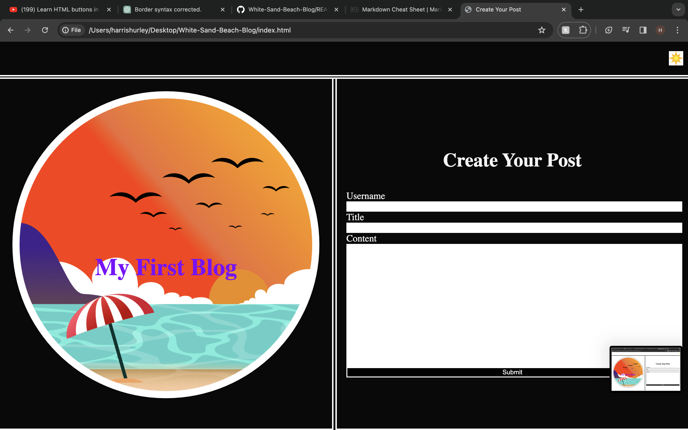
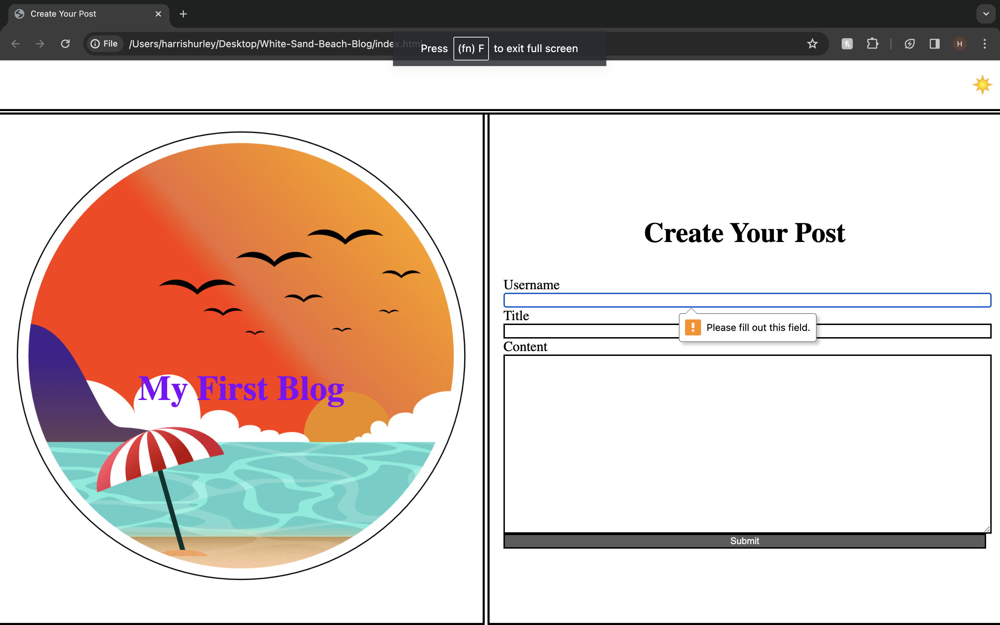
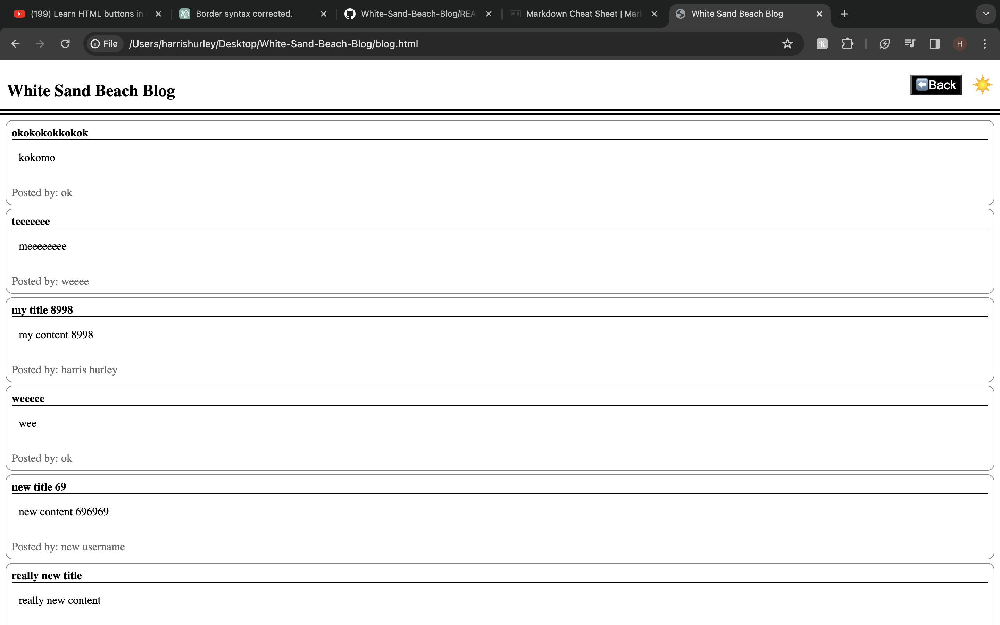
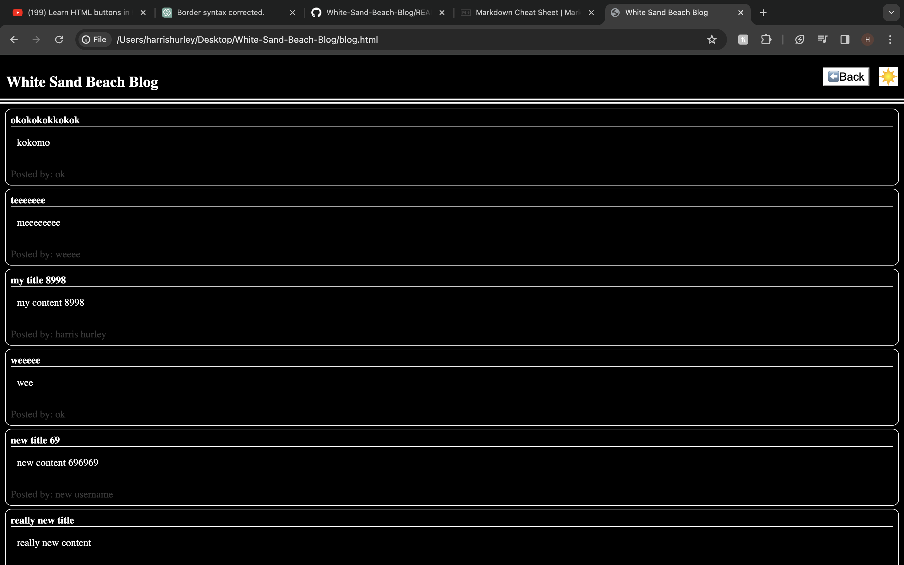
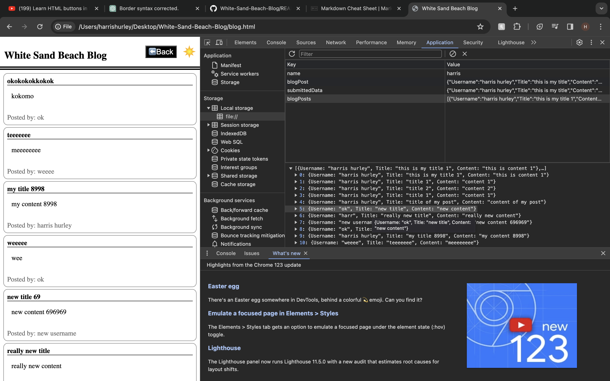

# White-Sand-Beach-Blog

## Description

Welcome to our vibrant community of bloggers and readers! The White Sand Beach Blog provides a platform for individuals to share their stories, insights, and experiences with the world. Whether you're a seasoned writer or someone with a story to tell, our platform offers an inclusive space for expression and connection.

## Table of Contents (Optional)

- [Installation](#installation)
- [Usage](#usage)
- [Images](#images)
- [Credits](#credits)
- [License](#license)
- [Features](#features)
- [Pages](#pages)

## Installation

N/A

## Usage

1. Create Your Blog Post:
    - Navigate to the form page.
    - Fill in your username, a captivating title, and engaging content.
    - Hit the submit button to publish your blog post and share your story with the world.

2. Discover Inspiring Content:
    - Visit the blog page to explore a diverse range of blog posts.
    - Click on individual posts to read the full content and engage with the authors through comments and feedback.

## Images

## Credits

[CodeCreative](https://www.youtube.com/watch?v=CUEJkJ9HDbY): Helpful Tutorial for dark and light theme

[MDN Web Docs](https://developer.mozilla.org/en-US/): Incredably usful docs and all things coding

[ChatGPT](https://chat.openai.com/c/290c33f0-11c4-460e-b422-6ddce4821125): Y'all know exactly why this is here.

[Bro Code](https://www.youtube.com/watch?v=_2wARy-oevQ&t=72s): Learn HTML buttons in 5 Minutes

## License

MIT License

Copyright (c) 2024 harrismhurley

Permission is hereby granted, free of charge, to any person obtaining a copy
of this software and associated documentation files (the "Software"), to deal
in the Software without restriction, including without limitation the rights
to use, copy, modify, merge, publish, distribute, sublicense, and/or sell
copies of the Software, and to permit persons to whom the Software is
furnished to do so, subject to the following conditions:

The above copyright notice and this permission notice shall be included in all
copies or substantial portions of the Software.

THE SOFTWARE IS PROVIDED "AS IS", WITHOUT WARRANTY OF ANY KIND, EXPRESS OR
IMPLIED, INCLUDING BUT NOT LIMITED TO THE WARRANTIES OF MERCHANTABILITY,
FITNESS FOR A PARTICULAR PURPOSE AND NONINFRINGEMENT. IN NO EVENT SHALL THE
AUTHORS OR COPYRIGHT HOLDERS BE LIABLE FOR ANY CLAIM, DAMAGES OR OTHER
LIABILITY, WHETHER IN AN ACTION OF CONTRACT, TORT OR OTHERWISE, ARISING FROM,
OUT OF OR IN CONNECTION WITH THE SOFTWARE OR THE USE OR OTHER DEALINGS IN THE
SOFTWARE.

## Features

- Create Captivating Blog Posts: Express yourself freely by creating blog posts using our intuitive form. Share your unique perspective with others by crafting engaging titles and compelling content.

- Explore a Wealth of Content: Dive into a treasure trove of blog posts contributed by users from diverse backgrounds and interests. From travel tales to insightful reflections, there's something for everyone to discover.

- Toggle Dark Mode: Enhance your reading experience with our Dark Mode feature, providing a comfortable viewing environment, especially during late-night browsing sessions.

- Seamless Navigation: Effortlessly switch between the form page and the blog page using our intuitive navigation menu. Explore new blog posts or create your own with just a click.

## Pages:

1. Form Page: Kickstart your blogging journey by creating your own blog posts. Input your details, unleash your creativity, and share your unique perspectives with the world.

2. Blog Page: Immerse yourself in a treasure trove of stories and insights shared by our community members. Discover new perspectives, learn from others' experiences, and engage with fellow readers through comments and feedback.